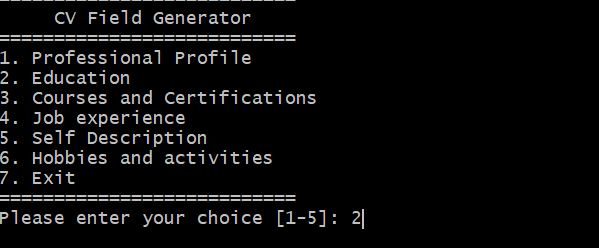

# Scripts for work automation

## CV generator

This is a bash script for automation of the cv creation according to wanted professional profile.

### Running
For launch the script, in the scripts folder execute the thee next oommand in a terminal wich has reference to /bin/bash interpreter:
```
./launcher_menu.sh

```
The next is the start of the script:


0r

```
 ./launcher_menu.sh -x
```
for debugging

### Move the latex templates to the parent templates directory
The templates latex files lives in
```
../templates/
```

### Select a option for populate the a part of the CV



### The structure of the project for look for every part of the cv is

